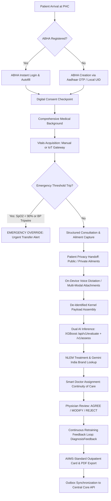
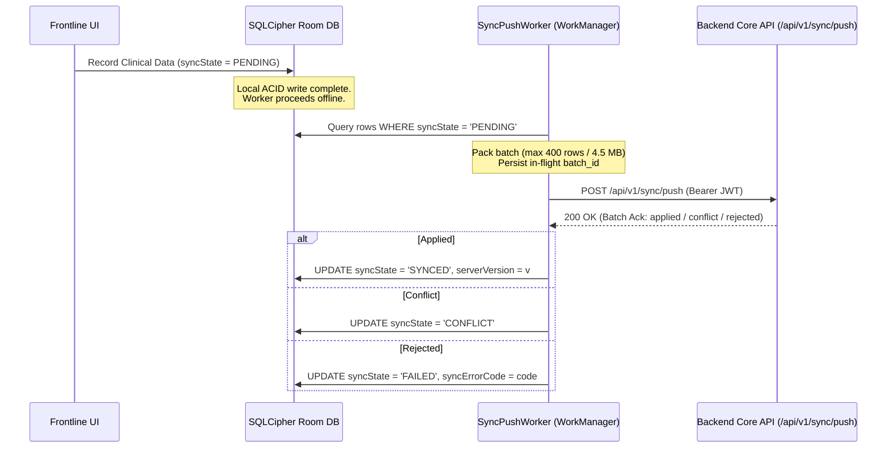

<!-- STATUS BANNER: do not remove without a documented review. -->

> ## ⚠ UNREVIEWED, AI-AUTHORED. NOT A CONTROLLED DOCUMENT.
>
> This file was generated by an AI tool and has **not** been reviewed, verified, or approved by a
> human author. It is committed only to preserve the traceability record of what the tool produced.
>
> - The regulatory claims in this document (CDSCO Medical Device Rules 2017 Class B/C,
>   IEC 62304 Class B, ISO 14971, ABDM M1/M2) are **NOT verified**. Do not cite them, rely on them,
>   or submit them.
> - This document is **NOT** part of the controlled document set in `docs/quality/`, and must not be
>   moved there or referenced as controlled evidence without a documented review and approval.
> - Statements of implementation status here have not been checked against the working tree.
>   Where this document and the code disagree, the code wins.

---

# SaMD-App: Product & Development Engineering Report

> **Document Type:** UNREVIEWED AI-generated report. NOT a controlled document.  
> **Platform:** Software as a Medical Device (SaMD) for Rural Primary Health Care  
> **Repository:** `ren276/SaMD-App`  
> **Regulatory Target:** CDSCO Medical Device Rules 2017 (Class B/C), IEC 62304 (Class B), ISO 14971, ABDM M1/M2  
> **Date:** September 2026  
> **File Location:** `docs/product-and-development-report.md`

---

## 1. Executive Summary & Product Vision

### 1.1 The Clinical & Systemic Challenge
In rural India, Primary Health Centres (PHCs), sub-centres, and Ayushman Arogya Mandirs (AAMs) are the frontline of healthcare delivery for over 800 million citizens. These facilities operate under extreme structural constraints:
- **Severe Clinician Shortages:** Frontline duties are managed by non-specialist community healthcare cadres—Accredited Social Health Activists (ASHAs), Auxiliary Nurse Midwives (ANMs), staff nurses, and compounders—while licensed medical officers (MOs) are often remote or overwhelmed.
- **Connectivity & Infrastructure Barriers:** Point-of-care facilities face frequent power outages and intermittent cellular connectivity, rendering conventional cloud-dependent EHRs unusable.
- **Diagnostic Uncertainty & Delay:** Frontline workers lack decision-support tools, leading to missed early-stage red flags, inappropriate empirical medication, or unnecessary tertiary referrals.
- **Fragmented Records:** Paper-based documentation limits longitudinal tracking and prevents integration into India's Ayushman Bharat Digital Mission (ABDM).

### 1.2 The SaMD Solution
**SaMD-App** is an offline-first, dual-channel Software as a Medical Device (SaMD) built to empower frontline healthcare teams while maintaining strict medical safety and regulatory compliance. The platform captures patient demographics, medical history, vitals, and structured clinical narratives at the point of care; screens for emergency physiological red flags; runs dual AI/ML clinical inference for diagnostic differentials and National List of Essential Medicines (NLEM 2022) treatment recommendations; and connects asynchronously to licensed physicians for formal prescription sign-off and continuous model retraining.

### 1.3 Target Personas & Core Value Proposition
| User Role | Operating Context | Core Value Proposition |
| :--- | :--- | :--- |
| **Frontline Health Worker**<br>*(ASHA / Nurse / Compounder)* | Point-of-care at PHC / field visits; intermittent connectivity | Frictionless, offline-first intake; automated vitals acquisition; guided structured complaints; patient privacy handoff; emergency red-flag safeguards. |
| **Reviewing Physician**<br>*(PHC / Tele-Consultation Doctor)* | Asynchronous review via dedicated clinic workflow | AI-triaged differential diagnoses; NLEM drug & dosage proposals with India-brand lookup; one-tap Agree/Modify/Reject review; continuity-of-care attribution. |
| **Patient / Citizen** | Rural resident presenting at PHC | Seamless ABHA identity creation; confidential symptom reporting (private handoff); bilingual AIIMS-standard clinical card with verification barcode. |
| **Health Administrator / CMO** | District & State Health Mission | Tamper-evident audit trails; automated referral tracking to CHCs/District Hospitals; population health sync. |

---

## 2. End-to-End Product Architecture & Functional Journey



---

## 3. Product Features: Implemented Capabilities & Active Engineering

### 3.1 Identity, Registration & Onboarding
- **Offline-First 12-Character Alphanumeric UID (`REQ-REG-03`):** In the absence of a central database connection, the device mints a cryptographically secure 12-character alphanumeric UID (`SecureRandom` over a 62-character alphabet, $62^{12}$ keyspace). This prevents collisions across field tablets without requiring an online counter.
- **Strict Demographic Input Validation (`REQ-REG-01, REQ-REG-02`):** Validates 10-digit Indian mobile numbers, 12-digit Aadhaar numbers, 6-digit postal PIN codes, and 14-digit ABHA numbers at entry time. Enforces that at least one contact channel is registered.
- **Pediatric & Minor Guardian Mapping (`REQ-PED-01`):** Dedicated fields capture guardian name and relationship for patients under 18 years old.
- **ABHA Identity Integration (`REQ-ABH-01, REQ-ABH-02, REQ-ABH-03`):**
  - **ABHA Profile Enrollment:** Complete Aadhaar-OTP registration pipeline (`AbhaSignUpScreen`) communicating with backend ABDM adapters to mint canonical 14-digit ABHA identifiers.
  - **ABHA Instant Autofill:** Resolves patient demographics (full name, DOB, gender, address, pincode) directly into registration fields, tagging each field with a "From ABHA" badge that clears automatically upon manual edits.
  - **Masked-Mobile Protection:** Recognizes masked mobile values from ABDM profiles (`XXXXXX1234`), enforcing that workers capture a functional 10-digit communication number.

### 3.2 Clinical Triage, Vitals & Safety Guardrails
- **Bilingual Digital Consent Gate (`REQ-TRS-01`):** Displays a formal consent agreement in Hindi and English ("मरीज़ की सहमति ली गई" / "Patient consent obtained") before any clinical evaluation begins, recording an immutable `AuditAction.CONSENT_RECORDED` event.
- **Emergency Red-Flag Override (`REQ-TRS-02`):**
  - Evaluates objective physiological tripwires immediately after vitals entry:
    - Oxygen Saturation ($\text{SpO}_2$) $< 90\%$
    - Systolic Blood Pressure $< 90\text{ mmHg}$ or $> 180\text{ mmHg}$
    - Diastolic Blood Pressure $\ge 120\text{ mmHg}$
  - When triggered, logs `AuditAction.EMERGENCY_OVERRIDE` and locks the interface into a full-screen, high-contrast emergency transfer directive.
  - Terminates the store-and-forward consultation path immediately—acute life-threatening conditions cannot be queued for delayed doctor review.
- **Comprehensive Medical Background (`REQ-MBG-01, REQ-MBG-02`):** Tracks chronic medical/surgical histories, ongoing medications, allergies, family medical history, and social lifestyle factors, gated by a mandatory review summary modal before progressing.
- **Guided Vitals Capture & Provenance Tracking (`REQ-VIT-01, REQ-VIT-02, REQ-TRS-05`):** Captures systolic/diastolic BP, pulse rate, temperature, SpO2, respiratory rate, and blood glucose. Automatically calculates Body Mass Index (BMI). Records `VitalsCaptureMethod` (`MANUAL_CUFF`, `DIGITAL_MONITOR`, `PULSE_OXIMETER`, `THERMOMETER`) to maintain data provenance.
- **Hardware IoT Vitals Gateway Feature:** Connects over the local PHC network (`ACCESS_LOCAL_NETWORK`) to a physical Raspberry Pi sensor hub, providing one-tap automated telemetry acquisition from point-of-care digital cuffs and pulse oximeters, stamping per-field `ObservationSource.DEVICE` markers.

### 3.3 Patient Privacy & Consultation Documentation
- **Structured Ailments vs. Free-Text Symptoms (`REQ-AIL-01, REQ-CON-01`):** Captures chief complaints alongside structured ailment cards categorized as measurable (value + unit) or non-measurable (onset, duration bucket, severity score $1-10$, aggravating/relieving factors).
- **Patient Privacy Handoff Interstitial (`REQ-AIL-02`):**
  - Supports dual visibility: `PUBLIC` (visible to worker and doctor) and `PRIVATE` (confidential patient disclosure).
  - Toggling to `PRIVATE` displays a bilingual full-screen handoff modal: *"Hand the device to the patient / उपकरण मरीज़ को दें"*.
  - **Structural Security Guarantee:** When marked private, sensitive narrative descriptions, onset, and severity are completely stripped from the worker's ViewModel UI state (`CompounderViewModel.toListItem()`). The worker interface displays only a locked *"🔒 Private entry"* card.
- **Worker-Blind Audio Recording (`REQ-AIL-03`):** Allows patients to record private voice symptoms using an on-device `MediaRecorder`. By strict architectural construction, **no playback affordance exists** in the worker UI or domain model—protecting patient disclosures from unauthorized listening by field personnel.
- **Multi-Modal Consultation Attachments (`REQ-CON-01, REQ-RPT-02`):** Supports high-resolution photography of general patient presentation, targeted affected-area close-ups, video recordings, and clinical voice memos. Attachments are preserved bit-for-bit and passed unmodified to the clinical report and diagnostic engine.
- **On-Device Speech Recognition (ASR) Feature:** Integrates local, air-gapped transcription powered by an on-device Sherpa-ONNX / Parakeet int8 acoustic model. Features a dedicated Voice Confirmation Gate where raw transcripts must be explicitly reviewed and confirmed by the clinician before populating clinical fields.

### 3.4 Clinical AI/ML Decision Support & Treatment Recommendation
- **Pseudonymized Kernel Payload Boundary (`REQ-HAN-06`):** The data contract for ML inference (`KernelPayload`) strictly isolates clinical signals (vitals, chief complaint, duration, severity, history, attachments) and deliberately omits all identity fields (name, mobile, Aadhaar, ABHA, address).
- **Primary Inference: NLEM Treatment & Triage Engine (`REQ-EVL-01`):**
  - Communicates with FastAPI backend endpoint `POST /api/v1/evaluate`.
  - Employs an XGBoost clinical model trained on PHC diagnostic datasets.
  - Returns top diagnostic candidate, ranked differential diagnoses with individual confidence scores, safety/vitals-triage grading, and NLEM 2022 treatment guidelines (first-line drug, dosage formulation, route, frequency, and level of healthcare).
  - **Fail-Safe Posture:** This endpoint has **no mock fallback**; if the network or inference fails, treatment proposals are omitted entirely to prevent fabricating clinical medication.
- **Secondary Inference: Diagnostic Differential Engine (`REQ-HAN-07, REQ-HAN-08`):**
  - Calls `POST /v1/assess` for high-speed diagnostic differential scoring.
  - Equipped with an on-device fallback to a curated clinical scenario matrix (respiratory, gastrointestinal, febrile, neurological) if the network drops.
  - Stamps every assessment with an immutable `InferenceSource` marker (`REAL_INFERENCE` vs. `MOCK_FALLBACK`), surfaced directly in the clinician UI.
- **India Brand-Name Lookup Engine (`REQ-EVL-02`):** Integrates with Google Gemini API (`gemini-2.5-flash`, zero-latency thinking budget) to resolve the top-selling Indian pharmaceutical brand name and manufacturer for generic NLEM recommendations (e.g., Amoxicillin 500mg $\rightarrow$ *Novamox 500* by Cipla). Runs asynchronously and fails gracefully without blocking the clinical consultation.
- **On-Device Small Language Model (SLM) Inference Feature:** Incorporates an on-device Google MedGemma 1.5-4B-IT model running via Google LiteRT. Features a custom C++/Kotlin Stream Sanitizer that strips internal reasoning tokens and control tokens (`<unused0>..<unused6241>`, `[multimodal]`), ensuring clean clinical consultation summaries and approved record readbacks.

### 3.5 Physician Review, Prescription & Continuous Learning
- **Continuity-of-Care Doctor Assignment (`ResolveDoctorAssignmentUseCase`):**
  - Incorporates an empanelment engine based on primary care continuity-of-care models.
  - Automatically routes follow-up encounters to the patient's previous coordinating physician.
  - For new encounters, intelligently balances load to the least-busy active doctor in the health network.
- **Physician Review & Decision Workflow (`REQ-RX-01, REQ-RX-03`):**
  - Reviewing doctors access cases via `PatientSummaryScreen` and choose an explicit action:
    - **AGREE:** Adopts the AI-proposed diagnosis and NLEM prescription lines directly.
    - **MODIFY:** Allows custom drug, dosage, and brand entry, alongside selecting a corrected ICD diagnosis from the model's 18 trained candidate classes (`TRAINED_ICD_CANDIDATES`).
    - **REJECT:** Discards the proposed diagnostic path and prompts for manual clinical direction.
- **Continuous Algorithmic Retraining Feedback (`REQ-RFN-01, REQ-RFN-02`):**
  - Every doctor decision is persisted as a `DiagnosisFeedback` entity.
  - AGREE and MODIFY entries are tagged with `reimportable = true`, capturing verified clinical ground truth for subsequent ML retraining batches.
  - REJECT entries are tagged `reimportable = false`, preventing corrupted training cycles.
- **Standardized Prescription Formatting (`REQ-RX-02`):** Enforces National Medical Commission (NMC) and European standards prohibiting ambiguous Latin dosage abbreviations (`OD`, `BD`, `TDS`, `QID`, `SOS`, `HS`). Dosing frequencies are expanded in full text (e.g., *"Once daily after meals for 5 days"*).
- **Referral & Escalation Outbox (`REQ-REF-01`):**
  - A permanent "Refer to Higher Facility" affordance on the clinical report becomes active when an ailment severity $\ge 8/10$ or when a doctor rejects an AI recommendation.
  - Generates a `ReferralRequest` with urgency level (`ROUTINE`, `URGENT`, `EMERGENCY`) and auto-filled clinical rationale for Community Health Centres (CHCs) or District Hospitals.

### 3.6 Standardized Clinical Documentation & Export
- **AIIMS-Standard Outpatient Clinical Card (`REQ-RPT-01, REQ-RPT-02, REQ-RPT-03`):**
  - Formats clinical records into an A5 outpatient summary card modeled on All India Institute of Medical Sciences (AIIMS) OP cards.
  - Built with a custom, dependency-free `android.graphics.Canvas` layout engine, avoiding heavy third-party PDF libraries.
  - **Header Block:** Institutional emblem, PHC name, CR Number, and a machine-readable Code-128B barcode encoding the patient UID.
  - **Demographics & Vitals Table:** Two-column matrix with age, sex, address, ABHA status, and measured physiological indicators.
  - **Clinical Findings:** Verbatim chief concern, categorized ailments, and inline attachment photos.
  - **Rx & Advice:** Formatted medication lines, dietary advice, follow-up date, and a double-underlined physician signature block with NMC registration number.
  - **Vector PDF Exporter:** Renders identical canvas pages directly to `android.graphics.pdf.PdfDocument` for instant printing or sharing via Android's native print spooler.

---

## 4. Engineering Architecture & Technical Specifications

```
SaMDApp/
├── app/src/main/java/com/example/samdapp/
│   ├── presentation/       # Jetpack Compose UI (25+ screens, Material 3, MVI/MVVM)
│   ├── domain/             # Pure Kotlin domain logic (0 Android dependencies, Use Cases, Models)
│   ├── data/               # Room DB (SQLCipher), Repositories, Retrofit Services, WorkManager
│   └── di/                 # Hilt Dependency Injection Modules
├── backend/
│   ├── core/               # FastAPI Core API (Python 3.12, SQLAlchemy 2.0, PostgreSQL 16)
│   │   ├── app/adapters/   # Kernel proxy, circuit breakers, PHI filtering
│   │   ├── app/api/        # Auth, Patients, Encounters, Sync, ABDM endpoints
│   │   └── app/db/         # Alembic migrations, pgcrypto types, advisory locks
│   └── abdm-adapter/       # ABDM M1 Aadhaar-OTP & X-Token bridge
```

### 4.1 Android Client Architecture
- **Language & Runtime:** Kotlin 2.0+ targeting Android SDK 34 (Android 14) with backward compatibility to `minSdk 26` (Android 8.0 Oreo), ensuring compatibility with legacy government-procured field tablets.
- **Presentation Layer:** 100% Jetpack Compose using Material Design 3. Strictly zero XML layouts.
- **Architectural Pattern:** Unidirectional Data Flow (UDF) via MVVM + Clean Architecture:
  - `presentation/` depends strictly on `domain/`.
  - `domain/` contains zero Android platform imports, enabling fast JVM unit testing.
  - `data/` implements domain repository contracts.
- **Dependency Injection:** Dagger-Hilt with compile-time verification across all application, activity, and worker scopes.
- **Database & Local Encryption:**
  - Room ORM v13+ schema.
  - **SQLCipher Full-Database Encryption:** The database file is encrypted at rest using 256-bit AES cipher keys managed securely by the hardware-backed Android Keystore.
- **Tamper-Evident Local Audit Engine:**
  - `AuditLogEntity` and `AuditLogDao` implement an insert-only ledger.
  - The DAO exposes no `UPDATE` or `DELETE` methods, satisfying IEC 62304 and ISO 14971 auditability requirements.

### 4.2 Offline-First Synchronization Engine
The synchronization subsystem (`SyncOutboxDrainer`, `SyncPushWorker`, `SyncStatusImpl`) is built for intermittent networks:



- **Per-Record 4-State Machine:** Every syncable entity tracks:
  - `syncState`: `PENDING` (local write awaiting upload), `SYNCED` (server confirmed), `CONFLICT` (version collision), `FAILED` (unrecoverable validation rejection).
  - `serverVersion`: Server revision counter.
  - `localModifiedAt`: Timestamp updated on any mutation, automatically resetting `syncState` to `PENDING`.
- **Idempotency & Crash Resilience:** An in-flight `batch_id` is durably recorded in `InFlightBatchStore` prior to network transmission. If the process is terminated mid-flight, resume logic re-uses the same `batch_id`, ensuring the backend handles replays idempotently without duplicate record creation.
- **Batch Budgets:** Outbox batches are capped at 400 records and 4.5 MB, maintaining safe margins below the backend's 500-record / 5.0 MB payload ceiling.

### 4.3 Backend Core API Architecture
- **Framework:** FastAPI running on Python 3.12 with asynchronous endpoints (`uvicorn`).
- **Database Engine:** PostgreSQL 16 with connection pooling (`asyncpg`), ORM managed by SQLAlchemy 2.0, and migrations via Alembic.
- **Column-Level PII Encryption:** Sensitive patient identifiers (`full_name`, `mobile_number`, `aadhaar_number`) are encrypted at the column level via PostgreSQL `pgcrypto` symmetric encryption.
- **Blind Indexing for Search:** Searchable encrypted fields are indexed using HMAC-SHA256 blind indexes (`name_blind_idx`, `mobile_blind_idx`), enabling exact-match patient lookups without exposing plaintext data.
- **Cryptographic Audit Hash-Chaining:** The `audit_events` table maintains an append-only, SHA-256 hash-chained log per facility. Mutating or deleting rows is blocked by a PL/pgSQL database trigger, creating an immutable audit trail.
- **Authentication & Rate-Limiting:** HS256 JWT access tokens (1-hour validity) paired with rotating refresh tokens (7-day validity). Includes token-reuse detection that revokes entire authorization chains upon anomalous replay.
- **Resilient Kernel Proxy:** Features a circuit breaker pattern (opens after 5 consecutive failures, fast-fails for 30 seconds, half-opens on recovery) and a strict PHI denylist filter preventing patient identifiers from reaching the ML kernel.

### 4.4 Automated Testing & Multi-Flavor CI/CD
- **JVM Test Suite:** Over 440 fast-executing unit tests covering use cases, repository mappings, state reducers, ASR voice gates, and report formatters.
- **Multi-Environment Flavors:**
  - `dev`: Cleartext traffic enabled, connects to local subnet ML servers and gateway testbeds.
  - `staging`: TLS enforced, points to sandbox cloud infrastructure and ABDM testing environment.
  - `prod`: Hardened security, cleartext blocked, production ABDM gateways.
- **GitHub Actions Automation:**
  - `android-ci.yml`: Automated compilation and unit testing across all three flavor dimensions on every pull request.
  - `backend-ci.yml`: Automated linting (`ruff`), type checking (`mypy strict`), schema validation (`alembic check`), and integration tests against real PostgreSQL service containers.
  - `android-release.yml`: Automated tag-triggered release packaging with automated APK signing and artifact generation.

---

## 5. Quality, Safety & Regulatory Posture

### 5.1 Regulatory Classification Derivation
Under the CDSCO Guidance Document on Medical Device Software (Doc No. `CDSCO/MD/GD/MDSW/01/2026`) and Medical Device Rules 2017:
- **Healthcare Situation:** **Serious** (PHC presentations span acute respiratory infections, hypertension, diabetes, and acute fevers).
- **Significance of Information:** **Drive Clinical Management** (The software analyzes patient vitals and symptoms to output specific differential rankings and NLEM drug/dosage recommendations).
- **Classification Result:** **Class B / Class C**. While Table 2 establishes Class B for Serious $\times$ Drive, the guidance's non-clinical user note states that usage by frontline workers without on-site specialists in serious conditions may be classified as Class C. Development follows Class C rigor across risk management, documentation, and traceability.

### 5.2 IEC 62304 & ISO 14971 Risk Controls Matrix

| Hazard ID | Clinical & Operational Risk | Implemented Engineering Control | Verification Evidence |
| :--- | :--- | :--- | :--- |
| **H-01** | Erroneous vitals data driving incorrect AI output | Plausible physiological range validation; automated IoT device capture. | `VitalsValidationTest` |
| **H-02 / H-09** | Clinician over-reliance on unvalidated AI output | Bold liability banner; mandatory verification checkbox; `inferenceSource` marker. | `KernelAssessmentScreenTest` |
| **H-03** | Record mismatch / patient mix-up in busy PHC | Persistent patient banner across consultation; 12-char alphanumeric UID; Code-128 barcode. | `AppNavHostTest`, `Code128Test` |
| **H-04** | Data breach of sensitive health records on lost/stolen field tablet | 256-bit SQLCipher DB encryption; Android Keystore; day-scoped patient queries (`REQ-ROS-02`). | `RoomDatabaseModuleTest`, CI Join Checks |
| **H-06** | Unauthorized worker impersonation in audit log | BiometricPrompt authentication gate; SHA-256 worker session derivation. | `AuthViewModelTest`, `BiometricAuthTest` |
| **H-07** | Tampering with clinical audit trail | Insert-only Room DAO; server-side PostgreSQL hash-chained audit trigger. | `AuditLogDaoTest`, `test_audit_chain.py` |
| **H-08** | Inadvertent clinical submission | Mandatory review-summary dialogs prior to consultation and medical history submission. | `ConsultationReviewDialogTest` |
| **H-10** | Leakage of Protected Health Information (PHI) to AI models | Strict `KernelPayload` boundary excluding name, contact, Aadhaar, and ABHA; backend PHI denylist. | `SendToKernelUseCaseTest`, `test_phi_guard.py` |
| **H-15 / H-21** | Voice recognition hallucination in clinical notes | On-device Sherpa-ONNX; Voice Confirmation Gate requiring explicit review before field insertion. | `VoiceGateStateModelTest` |
| **H-22 / H-23** | SLM control-token leakage or disclaimer suppression | Native stream sanitizer stripping `<unused*>` and `[multimodal]` ranges; fail-closed boundaries. | `SlmStreamSanitizerTest` |

---

## 6. Comprehensive Feature Matrix & Delivery Roadmap

### 6.1 Phase 1 & 2: Field Foundation & Point-of-Care Triage (Operational)
- [x] **Patient Registration & Unique UID:** Alphanumeric 12-char UID allocation and contact validation.
- [x] **ABHA Identity Engine:** Aadhaar OTP sign-up, profile retrieval, and instant demographic autofill.
- [x] **SQLCipher Storage Security:** 256-bit AES encrypted Room database with Android Keystore integration.
- [x] **Biometric Access Gate:** BiometricPrompt protection securing field-worker sign-in.
- [x] **Emergency Red-Flag Override:** Automatic SpO2 and BP threshold tripwire triggering urgent facility transfer.
- [x] **Bilingual Consent Flow:** Pre-examination Hindi/English consent gate with audit logging.
- [x] **Structured Ailment Capture:** Measurable and non-measurable symptom inputs with onset and severity scoring.
- [x] **Patient Privacy Handoff:** Dedicated patient interstitial and worker-blind private symptom capture.
- [x] **Worker-Blind Audio Recording:** Secure on-device audio recording with playback disabled for field staff.

### 6.2 Phase 3 & 4: Clinical AI Inference & Documentation (Operational)
- [x] **Dual ML Inference Pipeline:** FastAPI `/api/v1/evaluate` (NLEM treatment) and `/v1/assess` (differentials).
- [x] **Transparent Inference Auditing:** `InferenceSource` stamping (`REAL_INFERENCE` vs. `MOCK_FALLBACK`).
- [x] **India Brand Lookup:** Gemini 2.5 Flash integration for immediate generic-to-brand medicine mapping.
- [x] **Explainable AI UI:** Confidence gauge, differential ranking, reasoning summary, and liability confirmation.
- [x] **AIIMS Outpatient Card Engine:** A5 canvas rendering with Code-128 barcode, demographics, and Rx advice.
- [x] **Vector PDF Exporter:** Native Android `PdfDocument` generation for direct thermal/spool printing.
- [x] **Multi-Modal Attachments:** Clinical photos, affected-area close-ups, and audio attachments rendered in report.

### 6.3 Phase 5 & 6: Physician Review & Offline Synchronization (Operational)
- [x] **Physician Review Flow:** In-app Agree, Modify, and Reject decision actions for tele-consultation MOs.
- [x] **Retraining Feedback Engine:** `DiagnosisFeedback` logging with structured ICD-10 validation.
- [x] **Continuity-of-Care Empanelment:** Automated provider attribution for follow-up patient encounters.
- [x] **Standardized Prescription Engine:** Full-text frequency expansion eliminating ambiguous Latin abbreviations.
- [x] **Facility Referral Outbox:** Structured transfer requests for Community Health Centres and District Hospitals.
- [x] **Offline Outbox Engine:** WorkManager `SyncPushWorker` with crash-safe batch idempotency and 4-state tracking.
- [x] **Backend Core API & Security:** PostgreSQL column encryption (`pgcrypto`), blind indexing, and hash-chained audit trails.
- [x] **ABDM M1 Adapter:** Asynchronous Aadhaar OTP verification and transaction state machines.

### 6.4 Advanced Capabilities & In-Flight Roadmap Features
- [x] **Air-Gapped Speech Recognition (ASR):** On-device Sherpa-ONNX / Parakeet int8 transcription engine with clinician confirmation gating.
- [x] **On-Device Small Language Model (SLM):** LiteRT MedGemma 1.5-4B-IT edge inference engine with C++ control-token stream sanitization.
- [x] **Point-of-Care IoT Gateway:** Local network discovery (`ACCESS_LOCAL_NETWORK`) and automated sensor acquisition via Raspberry Pi relay.
- [ ] **Cloud Roster Synchronization (Phase 7):** `RemoteMediator` implementation for bi-directional patient record pull and historical lookup.
- [ ] **ABDM M2/M3 Health Information Provider (HIP):** FHIR bundle generation and health record exchange across the national ABDM gateway.
- [ ] **Multi-Language Voice Expansion:** Extension of on-device ASR models to regional Indian languages (Hindi, Marathi, Telugu, Tamil).
- [ ] **Automated Purge-on-Sync:** Post-sync data minimization engine automatically purging historical records outside the active care window.

---

## 7. Conclusion

SaMD-App demonstrates that clinical AI, patient privacy, and regulatory rigor can be effectively synthesized into a practical, resilient tool for rural healthcare workers. By pairing offline-first mobile architecture with robust cryptographic auditability, dual-engine clinical decision support, and strict human-in-the-loop governance, the platform establishes a scalable foundation for deploying Software as a Medical Device across primary healthcare networks in India and developing regions worldwide.
